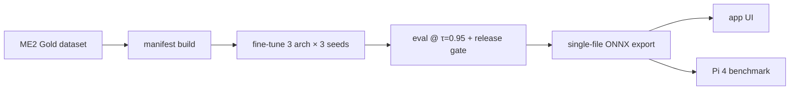

# aaf-ai231-me2

A reproducible, one-command pipeline for a **tiny on-device voice-command model**
(AI231 ME2 submission): from the class dataset to a fine-tuned keyword-spotting
model running on a Raspberry Pi 4.

- **Models:** TC-ResNet ("Sweep"), CRNN-Attn ("Focus"), and a DS-CNN benchmark —
  each ~68 k parameters, fine-tuned in 3 seeds on the ME2 Gold dataset.
- **Deployed:** `E1f_s1` (CRNN-Attn, τ = 0.95) as the default, `B2f_s0`
  (TC-ResNet) as secondary.
- **Edge target:** Raspberry Pi 4, single-thread ONNX runtime, real-time factor 0.008.



## Quickstart

```bash
git clone --recursive https://github.com/awifresnido/aaf-ai231-me2.git
cd aaf-ai231-me2
./reproduce.sh                # setup → data → weights → eval → export → app
./reproduce.sh --dry-run      # print every command and URL, run nothing
```

On the DGX A100 cluster:

```bash
./reproduce.sh --train dgx --gpus 0,1,3     # manifest → 9 fine-tune runs → eval → gate
./reproduce.sh --pi <user@host>             # deploy edge to the Pi + run the class benchmark
```

## Results (τ = 0.95, pooled 3 seeds)

Holdout slice — 202 clips from an unseen speaker, synthetic held-out voices, and
out-of-scope negatives:

<!-- AUTOGEN:results -->
| Model (arch) | holdout_only | holdout_real | holdout_syn | holdout FAR |
|---|---|---|---|---|
| **E1f (CRNN-Attn)** | 89.25 % | 77.78 % | 99.67 % | 6.25 % |
| **B2f (TC-ResNet)** | 86.20 % | 69.84 % | 100.00 % | 6.25 % |
| **G2f (DS-CNN)** | 61.29 % | 30.56 % | 88.33 % | 2.08 % |
| **v1 E1 (CRNN-Attn)** | 86.38 % | 73.81 % | 97.67 % | 6.25 % |
| **v1 B2 (TC-ResNet)** | 86.20 % | 71.83 % | 99.00 % | 10.42 % |
| **v1 G2 (DS-CNN)** | 60.22 % | 29.37 % | 87.00 % | 4.17 % |

<!-- /AUTOGEN:results -->

Live Pi-4 benchmark (`20261003-005002`, full run, E1f_s1, 218 inputs): intent
accuracy **80.7 %** [75–86 %], false-accept 6.2 %, false-wake 0.0 %, wake detect
92.1 %, inference p95 38.9 ms, RTF 0.008.

> The release-gate verdict (`decision.json`) is `replace_v1 = false` for all three
> fine-tunes; **E1f_s1 was still chosen as the app default** (the logged deviation)
> because it lifts the group test speaker by +17.7 pt and cuts Single-Words FAR
> from 2.06 % → 0.58 % at the cost of a small personal-speaker regression. See
> `docs/evaluation.md`.

## Repository layout

```
configs/     ontology, train configs, run lists, data.yaml
training/    model code + data/eval/export/launcher scripts
app/         edge service + laptop control-center UI
bench/       vcm-benchmark submodule (pinned)
results/     eval JSON, decision.json, benchmark offline, live Pi run, checksums
docs/        data, training, evaluation, deployment, reproduction, limitations
```

See `SUBMISSION.md` for the slide-2 table and `docs/reproduce.md` for
per-stage expected outputs and wall-clock times.

## Checklist coverage

| # | Reviewer checklist item | Where |
|---|---|---|
| 1 | One-command reproduction | `./reproduce.sh`, `docs/reproduce.md` |
| 2 | Dataset licensed + citable | `docs/data.md`, `CITATION.cff`, `configs/data.yaml` |
| 3 | Training logs + checkpoints | `results/me2_gold/logs/`, GitHub Release + `checksums.sha256` |
| 4 | Pi latency reproduced | `scripts/bench_pi.sh`, `results/me2_gold/live/20261003-005002/` |
| 5 | Held-out test, unseen speakers | `docs/evaluation.md#holdout`, `results/me2_gold/eval_*.json` |
| 6 | Baseline of comparable size | DS-CNN vs CRNN-Attn vs TC-ResNet (table above) |

## Licences

- Code: **MIT** (`LICENSE`)
- Model weights: **CC BY-NC 4.0** (`LICENSE-WEIGHTS.md`)
- Dataset: per-source terms; FSC is non-commercial academic use; no audio is
  re-hosted in this repository (`docs/data.md`).
- Wake word (`hey_rhasspy`): **openWakeWord** by David Scripka
  (https://github.com/dscripka/openWakeWord) — code Apache-2.0, pretrained models
  CC BY-NC-SA 4.0.
